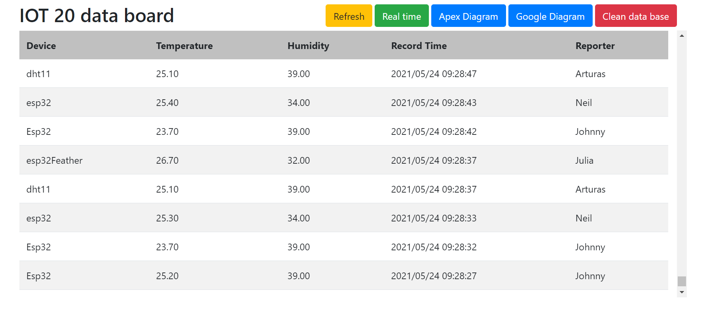
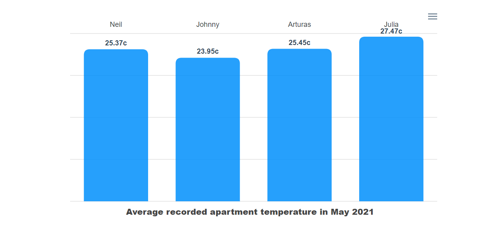
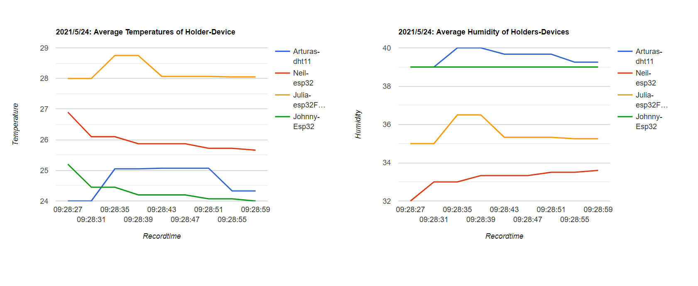
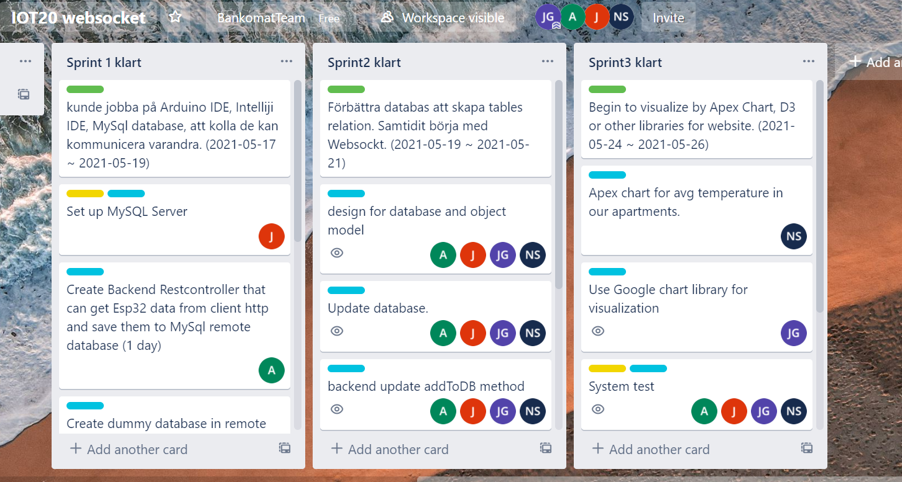

# IOT Project Websocket

This is a group groject in system intergration using websocket.

## Arduino -> Esp32 + DHT11 + Websocket

Esp32 send temperature and humidity to backend server by websocket

## Intelliji -> Springboot + Websocket

When backend server receive the message, broadcast it to the frontend.

## Database -> MySQL on a server

Build own MySQL server host to handle transactions from the groups' devices and save them to database.

## Home page

## Apex bar chart

## Google line chart

## Trello

